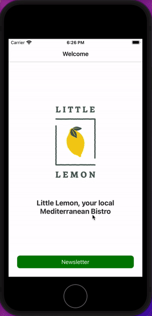

## Little Lemon

This is the code example for the newsletter subscription application.



---

## Prerequisites

- **Node.js** (current LTS recommended): [nodejs.org](https://nodejs.org/)
- **npm** (comes with Node)
- **Expo Go** on your phone ([iOS App Store](https://apps.apple.com/app/expo-go/id982107779) / [Google Play](https://play.google.com/store/apps/details?id=host.exp.exponent)) for testing on a physical device
- For **iOS Simulator**: Xcode (macOS only)  
- For **Android Emulator**: Android Studio with an AVD

This project targets **Expo SDK 54**. Use a recent **Expo Go** from the store so the app version matches the project (see [Expo Go](https://expo.dev/go) if you need a specific SDK build).

---

## Install dependencies

From the project root:

```bash
npm install
```

If you cloned a zip without `node_modules`, this step is required before running anything.

---

## Run the app

Start the Metro bundler and Expo dev tools:

```bash
npm start
```

Then:

| Action | Command / shortcut |
|--------|-------------------|
| **iOS Simulator** (macOS) | Press `i`, or run `npm run ios` |
| **Android Emulator** | Press `a`, or run `npm run android` |
| **Web browser** | Press `w`, or run `npm run web` |
| **Physical device (Expo Go)** | Scan the QR code in the terminal, or use **Enter URL manually** in Expo Go (see below) |

Stop the server with **Ctrl+C**.

---

## Physical device (Expo Go)

1. Connect your phone and computer to the **same Wi‑Fi** (avoid guest networks that block device-to-device traffic if possible).
2. Run `npm start` in a normal terminal (so the QR code and shortcuts work).
3. Open **Expo Go** and scan the QR code, or enter the URL shown (often `exp://YOUR_LAN_IP:8081`).

If you cannot scan a QR code or need the URL printed:

```bash
npm run go:url
```

Paste the printed `exp://…` into Expo Go (**Projects → Enter URL manually**). The script defaults to port **8081** (typical for Metro). If your terminal shows a different port, run `npm run go:url -- 19000` (replace with the port you see).

Do **not** use `127.0.0.1` or `localhost` on the phone; those refer to the phone itself.

If LAN connection fails (corporate Wi‑Fi, strict firewall, etc.):

```bash
npm run start:tunnel
```

Use the tunnel URL or QR code Expo prints after ngrok starts.

---

## Useful scripts

| Script | Purpose |
|--------|---------|
| `npm start` | Default dev server |
| `npm run start:tunnel` | Dev server over a tunnel (easier on restrictive networks) |
| `npm run go:url` | Print an `exp://` URL for Expo Go when the QR code is not available |
| `npm run ios` | Open in iOS Simulator |
| `npm run android` | Open in Android Emulator |
| `npm run web` | Open in the web browser (Metro web) |

---

## Health check (optional)

```bash
npx expo-doctor
```

---

